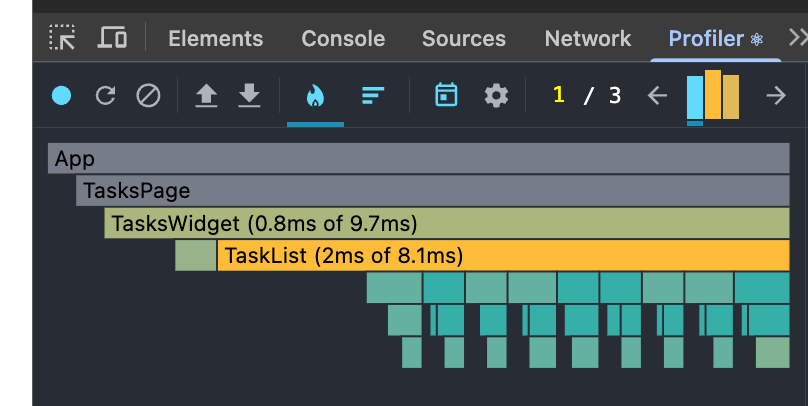
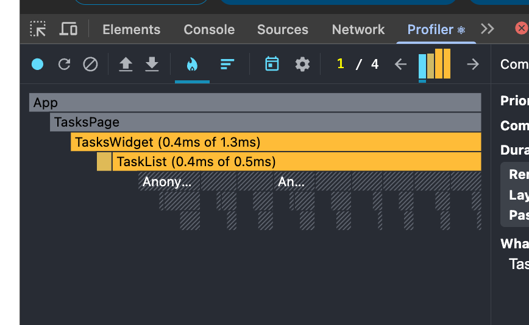

## Правки по ДЗ №1

---
> Удаление — кнопка удаления должна быть на button, не на div

Исправил

---

> TaskCard — по заданию должен быть презентационным (без callbacks). Лучше вынести удаление в TaskList. 

Готово, вынес все в TaskList.

---

> FilterButton — сейчас это select. В задании ожидаются кнопки фильтра (Все / Выполненные / Невыполненные).

Перечитал задание, не указано что должно быть три кнопки  с переключением, плюс с Нелли обсуждали что селект это корректное и рабочее решение.

---

## Скрины для ДЗ N2
Анализируем, что все таски перерисовывются по удалению любой из них.

Видимо что с оптимизацией это пропало.

